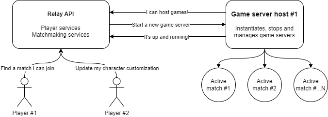
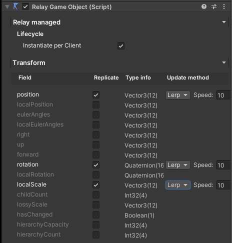
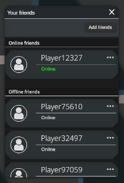
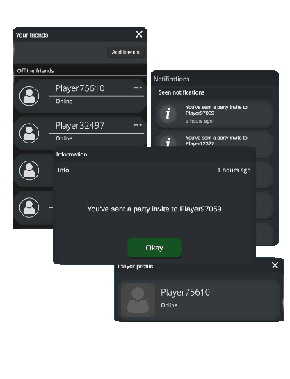
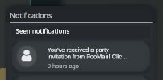
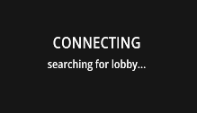

# RELAY

*Open-source backend infrastructure for multiplayer games, including matchmaking, lobbies, server browsers, and hosting tools for Unity.*

Do you want to develop **multiplayer** games and **social experiences** like for example Fall Guys or Among Us?

Well I wanted to solve that, **RELAY** is an entire **multiplayer infrastructure and dev-tool integration with Unity** that can be self-hosted or deployed to production-grade scalability in the cloud and lets you focus on expressing your social experiences and gameplay ideas.

## Key Features

- **Easy to use**: Abstracts the technical and messy networking details away so you'll be building your game in Unity and not dealing with external tools! Includes Unity prefabs that can be dropped in for smooth integration.
- **Matchmaking**: Supports highly configurable modern "Fall guys" style matchmaking as well as the good old conventional server browser UI.
- **Player services**: Let your players save their character customizations, earn points, generate statistics, send friend requests and jump into matches together.

### Infrastructure

- API handling matchmaking and player services
- Game server application servicing your games

### Unity toolkit

**RelayGameObject Component**

Iterates over all components attached to the same GameObject, built in as well as custom scripts and exposes check boxes for all public properties. Check which properties of a game object you want to distribute over the network to automatically synchronize them across clients. Also enables RPC for **ANY** method on **ANY** component attached to the same game object.

### Unity prefabs

Developing a multiplayer game is a lot of work. Its not only state synchronisation and rpc's, how do you get your players *in* together?

Relay includes UI prefabs to navigate and use all the matchmaking and player services. You can just drop it into your main menu scene.

**Friends list.**

Associate your player clients with a unique identifier. Enabling a player identity where they have a username and data storage. Allow them to manage friends list and invite each other in-game.

**Party system.**

A party system is included enabling your players to jump into matches together.

**Notification system.**

To navigate the invite options as well as information that you might want to post to their clients!

**Highly configurable modern matchmaking.**

Press play, find a server, you're in. Configurable lobby and matchmaking system.

## Acknowledgements

This project makes use of the following open-source projects:

- **Riptide**: A fast and lightweight networking library for .NET, specifically designed for games and real-time applications.
  - GitHub Repository: [RiptideNetworking/Riptide](https://github.com/RiptideNetworking/Riptide)
  
- **TinyJson**: A simple and fast JSON parser and serializer for .NET.
  - GitHub Repository: [pbhogan/TinyJSON](https://github.com/pbhogan/TinyJSON)

We extend our thanks to the developers and contributors of these projects for their hard work and dedication to open-source software.
